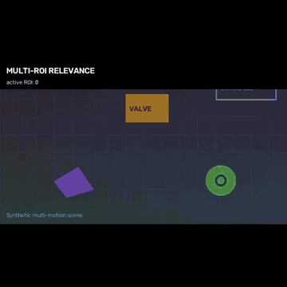
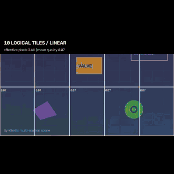
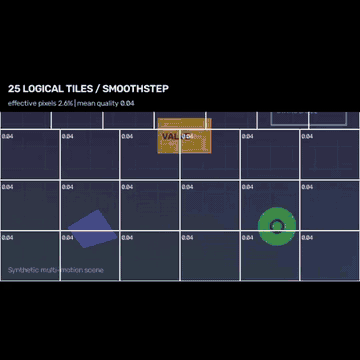
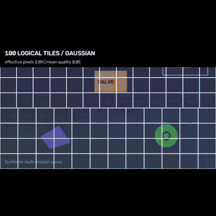
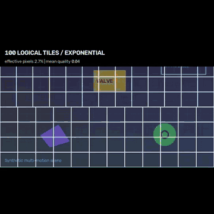
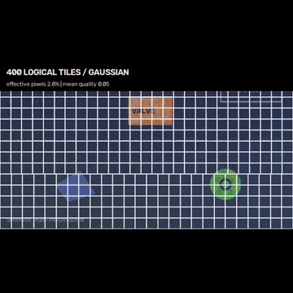
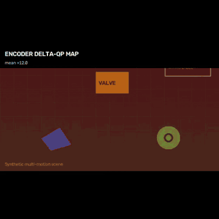
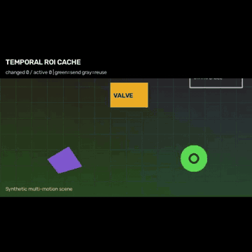
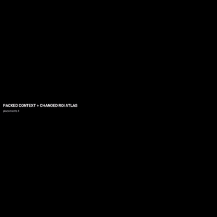

# FoveaStream

**Adaptive relevance-aware middleware for camera, video and machine-vision pipelines.**

FoveaStream sits between an existing frame source and an existing consumer. It keeps important spatial regions at higher fidelity and spends progressively less bitrate, pixels, resolution, requests, or high-resolution refreshes on less relevant content.

```text
camera / decoder / RTSP / WebRTC / file / AR glasses / robot
                              |
                              v
                        FoveaStream
                relevance + temporal state
                              |
     +-------------+------------+-------------+-------------+------------+
     |             |            |             |             |            |
     v             v            v             v             v            v
 same-size      context +    logical       encoder       temporal     SEND/SKIP
   frame         ROI layers     tiles        QP map         cache        policy
     |             |            |             |             |            |
     +-------------+------------+-------------+-------------+------------+
                              |
                              v
                  existing downstream system
```

FoveaStream is **provider agnostic**. The core does not depend on Gemini, OpenAI, WebRTC, GStreamer, CameraX, AVFoundation, a specific detector class, a camera vendor, or a model provider.

The same relevance state can drive several different actuators. A host uses the output representation that its downstream stack can actually consume.

---

# Documentation map

If you are integrating or extending the project, use these in order:

1. **This README** — architecture, quickstart, all major features and common usage.
2. [`docs/API_REFERENCE.md`](docs/API_REFERENCE.md) — complete Python public API grouped by purpose.
3. [`docs/TILE_POLICIES.md`](docs/TILE_POLICIES.md) — full tile-policy model and every custom callback hook.
4. [`docs/BENCHMARK_GALLERY.md`](docs/BENCHMARK_GALLERY.md) — one-command all-modes benchmark on your own video.
5. [`docs/ADAPTIVE_TRANSPORT.md`](docs/ADAPTIVE_TRANSPORT.md) — adaptive transport internals.
6. [`docs/FRAME_MIDDLEWARE.md`](docs/FRAME_MIDDLEWARE.md) — source -> transform -> sink middleware contract.
7. [`docs/AGENT_INTEGRATION.md`](docs/AGENT_INTEGRATION.md) — integration contract for coding agents.
8. [`docs/STATUS.md`](docs/STATUS.md) — exact current implementation boundary and durable handoff.
9. [`AGENTS.md`](AGENTS.md) — invariants and rules another coding agent must preserve.

---

# Quick start

## Pull latest

```powershell
git switch main
git pull origin main

.\.venv\Scripts\Activate.ps1
python -m pip install -r requirements.txt
```

If `.venv` does not exist yet:

```powershell
git clone https://github.com/SirPaul-code/foveated_streaming_lib.git
cd foveated_streaming_lib
.\scripts\setup.ps1
.\.venv\Scripts\Activate.ps1
```

Put a video in the repository root:

```text
foveated_streaming_lib/
  example.mp4
```

---

# Best first command: run every major mode on your video

```powershell
python bench\benchmark_gallery.py example.mp4
```

This is the recommended discovery workflow. It runs the main FoveaStream algorithms/settings and creates a folder containing videos, GIFs, JSON metrics, preset benchmarks and a human-readable index.

Output:

```text
output/gallery/example/
  INDEX.md
  report.json
  tile_matrix_runtime.json

  01_presets/
    balanced/
    aggressive/
    extreme/

  02_core_actuators/
    multi ROI
    representative tile modes
    encoder QP map
    temporal SEND/REUSE
    ROI atlas

  03_tile_counts/
    10 tiles
    25 tiles
    100 tiles
    400 tiles

  04_tile_curves/
    linear
    smoothstep
    gaussian
    exponential
    power

  05_tile_aggregation/
    mean
    p90
    max

  06_custom_policies/
    custom distance curve
    protected-focus cliff
    context-aware quality
    stepped resolution
    tiered QP
```

Every logical-tile policy folder contains:

```text
preview.mp4
preview.gif
metrics.json
```

The tile preview is two panels:

```text
left  = actual reference tile-resolution degradation
right = tile quality heat/grid
```

For additional numeric sweeps:

```powershell
python bench\benchmark_gallery.py example.mp4 --matrix full
```

Full gallery documentation: [`docs/BENCHMARK_GALLERY.md`](docs/BENCHMARK_GALLERY.md).

---

# Run a single configuration benchmark

```powershell
python bench\benchmark_suite.py example.mp4 `
  --preset aggressive `
  --tiles 100 `
  --tile-curve gaussian
```

This runs:

1. same-decoded-frame H.264 baseline vs FoveaStream RGB;
2. adaptive transport metrics;
3. logical tile metrics.

Output:

```text
output/benchmark_suite/example/
  example_benchmark_suite.json
  example_transport.json
  codec/
    example_baseline_crf23.mp4
    example_foveated_crf23.mp4
    example_visualization.mp4
    example_benchmark.json
```

---

# Watch the adaptive runtime on a video

```powershell
python examples\adaptive_transport.py `
  --video example.mp4 `
  --preset aggressive `
  --tiles 100 `
  --tile-curve gaussian
```

Headless:

```powershell
python examples\adaptive_transport.py `
  --video example.mp4 `
  --preset aggressive `
  --tiles 100 `
  --tile-curve gaussian `
  --no-preview
```

---

# Generate documentation-style GIFs from your own video

```powershell
python examples\generate_showcase.py example.mp4 `
  --outdir output\showcase_example
```

This creates MP4 + GIF visualizations for multi-ROI relevance, several tile modes, QP map, temporal ROI reuse and the packed atlas.

---

# What “relevance” means

FoveaStream does **not** define ROI as a face, person, car or another hardcoded semantic class.

An ROI means:

> **Spatial support whose loss of detail would disproportionately hurt the current downstream task.**

Relevance can come from:

- residual motion;
- user tap / rectangle;
- eye gaze / software gaze;
- AR anchor;
- saliency;
- OCR/text;
- depth/autofocus;
- hand/object interaction;
- detector/segmenter output;
- application/task rules;
- downstream model feedback;
- remote operator input;
- a learned relevance model.

Built-in fallback:

```text
frame t-1 + frame t
        |
        v
sparse feature tracking
        |
        v
global camera-motion estimate
        |
        v
warp previous frame
        |
        v
residual motion
        |
        v
connected components
        |
        +--> ROI proposal 1
        +--> ROI proposal 2
        +--> ROI proposal N
```

Motion is only one evidence source. Static but task-critical content should be supplied through stronger task evidence.

---

# Architecture

```text
                         arbitrary evidence
              motion / gaze / OCR / task / model / depth
                                 |
                                 v
                           EvidenceBus
                      timestamp + TTL fusion
                                 |
                                 v
                   persistent predictive multi-ROI
                                 |
                    latency-aware future state
                                 |
                                 v
                     continuous relevance field
                                 |
      +--------------------------+---------------------------+
      |              |              |            |           |
      v              v              v            v           v
 same-size RGB   context+ROI   logical tiles   QP blocks   SEND/SKIP
      |              |              |            |           |
      |         temporal cache   quality          |           |
      |              |           resolution       |           |
      |              |           QP suggestion    |           |
      |              v              |            |           |
      |         layered payload     |            |           |
      |              |              |            |           |
      |              v              v            |           |
      |         packed atlas   tiled transport    |           |
      +-------------------------- downstream ------------------+
```

Important rule:

> all actuators derive from the same persistent relevance state; do not build separate unrelated ROI systems for each output mode.

---

# Main output modes / actuators

## 1. Same-size foveated frame

Minimal drop-in path:

```python
from foveastream import FoveaStreamTransform

optimizer = FoveaStreamTransform(
    preset="aggressive",
    auto_motion_proposals=True,
)

optimized = optimizer.transform(frame_rgb, timestamp_s)
downstream.send(optimized.frame_rgb)
```

Output width/height stays unchanged.

Best for an existing encoder/API that only accepts a normal frame.

---

## 2. Context + high-resolution ROI layers

```python
out = adaptive.process(frame_rgb, timestamp_s)

images = [out.layered.context]
images += [
    region.image
    for region in out.layered.changed_rois
    if region.image is not None
]

model.send_images(images)
```

This reduces actual image pixels when the consumer accepts multiple images/layers.

---

## 3. Temporal ROI reuse

```text
frame 100: ROI A changed -> SEND
frame 101: ROI A same    -> REUSE
frame 102: ROI A same    -> REUSE
frame 103: ROI A same    -> REUSE
frame 104: ROI A changed -> SEND
```

Change is measured against the **last emitted high-resolution ROI state**, not just frame `N-1`.

A maximum refresh timeout prevents indefinite stale reuse.

---

## 4. Background tile cache

For mostly static image-space backgrounds:

```python
AdaptiveTransportConfig(background_cache=True)
```

Do not enable blindly for a freely moving camera. Without world/camera compensation, global motion invalidates many tiles.

---

## 5. Layered payload

```text
low-resolution global context
+
changed high-resolution ROI enhancements
+
optional changed background tiles
```

The low-res base preserves whole-scene context while expensive high-resolution content becomes selective and temporal.

---

## 6. Packed one-image atlas

For APIs that accept one image but not a list:

```python
if out.layered.atlas is not None:
    model.send_image(out.layered.atlas.image)
```

Conceptually:

```text
+----------------------------------+
| low-res whole-scene context      |
+----------------+-----------------+
| changed ROI 1  | changed ROI 2   |
+----------------+-----------------+
| changed ROI 3                    |
+----------------------------------+
```

---

## 7. Logical relevance tiles

Exact-count application/transport tiles:

```python
from foveastream import TilePlanner, TilePlannerConfig

planner = TilePlanner(
    TilePlannerConfig(
        target_tiles=100,
        curve="gaussian",
        curve_strength=3.0,
        aggregation="max",
        min_quality=0.04,
        min_resolution_scale=0.125,
        fovea_qp_delta=-4,
        periphery_qp_delta=18,
    )
)

plan = planner.plan(out.process_result.quality_map)
```

`target_tiles` is exact:

```python
TilePlannerConfig(target_tiles=10)
TilePlannerConfig(target_tiles=25)
TilePlannerConfig(target_tiles=100)
TilePlannerConfig(target_tiles=137)
TilePlannerConfig(target_tiles=400)
```

Each tile receives:

```text
normalized x/y/w/h
relevance
distance from relevance
quality
resolution_scale
qp_delta
```

A custom transport might consume it like:

```python
for tile in plan.tiles:
    transport.send_tile(
        tile_id=tile.index,
        rect=(tile.x, tile.y, tile.w, tile.h),
        resolution_scale=tile.resolution_scale,
        qp_delta=tile.qp_delta,
    )
```

`send_tile(...)` is adapter pseudocode. The core produces policy; the transport decides how to encode/send it.

---

## 8. Encoder block delta-QP map

Keep the original source frame and provide a portable spatial quality field to an encoder adapter:

```python
out.encoder_hints.block_size
out.encoder_hints.qp_delta_map
out.encoder_hints.rois
```

Conceptually:

```text
original frame ----------------------------+
                                          |
FoveaStream relevance -> block delta-QP --+--> encoder
```

Direct NVENC/MediaCodec/VideoToolbox/VAAPI translation is platform-adapter work.

---

## 9. SEND/SKIP

Continuous video:

```python
emit_policy="every_frame"
```

Event/request pipeline:

```python
emit_policy="when_send"
```

Do not silently apply scheduler frame suppression to a transport that requires continuous cadence.

---

# Logical tiles: built-in configuration

## Aggregation

```python
aggregation="max"
aggregation="p90"
aggregation="mean"
```

- `max`: safest for small important regions inside coarse tiles.
- `p90`: robust high-relevance aggregation.
- `mean`: more aggressive; small important regions can be diluted.

---

## Built-in degradation curves

```python
curve="linear"
curve="smoothstep"
curve="gaussian"
curve="exponential"
curve="power"
```

The curve maps:

```text
distance 0.0 -> highly relevant
distance 1.0 -> maximally irrelevant
```

to raw tile fidelity.

Shape parameter:

```python
TilePlannerConfig(
    curve="gaussian",
    curve_strength=4.5,
)
```

---

# Custom tile functions

FoveaStream supports several extension levels.

Full guide: [`docs/TILE_POLICIES.md`](docs/TILE_POLICIES.md).

## Level 1: your own distance -> quality function

```python
def my_degradation(distance: float) -> float:
    return max(0.0, 1.0 - distance ** 1.7)

planner = TilePlanner(
    TilePlannerConfig(
        target_tiles=100,
        min_quality=0.03,
        min_resolution_scale=0.10,
    ),
    degradation_fn=my_degradation,
)
```

`distance` and the returned raw quality are clipped to `[0,1]`. `min_quality` is applied after the callback.

---

## Level 2: context-aware quality function

For more advanced policies:

```python
from foveastream import TilePolicyContext


def quality_policy(ctx: TilePolicyContext) -> float:
    return max(
        ctx.max_relevance,
        0.8 * ctx.p90_relevance,
        0.55 * ctx.mean_relevance,
    )

planner = TilePlanner(
    TilePlannerConfig(target_tiles=100),
    quality_fn=quality_policy,
)
```

`TilePolicyContext` exposes:

```text
index / row / column
x / y / w / h
center_x / center_y / area_fraction
relevance / distance
mean_relevance / max_relevance / p90_relevance
map_width / map_height
```

`quality_fn` and `degradation_fn` are mutually exclusive because both own the raw-quality stage.

---

## Level 3: custom resolution mapping

```python
def stepped_resolution(ctx, quality):
    if quality >= 0.82:
        return 1.0
    if quality >= 0.55:
        return 0.5
    if quality >= 0.25:
        return 0.25
    return 0.125

planner = TilePlanner(
    TilePlannerConfig(target_tiles=100),
    resolution_fn=stepped_resolution,
)
```

Useful when the transport/hardware prefers discrete levels.

---

## Level 4: custom QP mapping

```python
def tiered_qp(ctx, quality):
    if quality >= 0.85:
        return -6
    if quality >= 0.60:
        return 0
    if quality >= 0.30:
        return 8
    return 18

planner = TilePlanner(
    TilePlannerConfig(target_tiles=100),
    qp_fn=tiered_qp,
)
```

---

## Combine advanced hooks

```python
planner = TilePlanner(
    TilePlannerConfig(
        target_tiles=137,
        aggregation="p90",
        min_quality=0.02,
        min_resolution_scale=0.125,
    ),
    quality_fn=quality_policy,
    resolution_fn=stepped_resolution,
    qp_fn=tiered_qp,
)
```

Copyable examples live in:

```text
examples/custom_tile_policy.py
```

---

# Visualize the actual tile resolution loss

`apply_tile_plan(...)` is a reference realization of each tile's `resolution_scale`:

```python
from foveastream import apply_tile_plan

degraded_rgb = apply_tile_plan(frame_rgb, plan)
```

It downsamples each tile to its requested spatial scale and upsamples it back into the same-size output rectangle.

This makes the loss visible and works as a generic reference path.

A real tiled transport should normally transmit the low-resolution tile itself rather than upscaling it before sending.

Heat/grid visualization:

```python
from foveastream import render_tile_plan

heat_rgb = render_tile_plan(frame_rgb, plan)
```

---

# Benchmark your own custom callback without modifying FoveaStream

Given `my_policy.py`:

```python
from foveastream import TilePolicyContext


def quality(ctx: TilePolicyContext) -> float:
    return max(ctx.p90_relevance, 0.6 * ctx.max_relevance)


def scale(ctx: TilePolicyContext, quality: float) -> float:
    return 1.0 if quality > 0.7 else 0.25
```

Run:

```powershell
python bench\benchmark_gallery.py example.mp4 `
  --custom-quality my_policy.py:quality `
  --custom-resolution my_policy.py:scale
```

Supported plugin switches:

```text
--custom-degradation FILE.py:function
--custom-quality FILE.py:function
--custom-resolution FILE.py:function
--custom-qp FILE.py:function
```

Result:

```text
output/gallery/example/09_user_policy/user_policy/
  preview.mp4
  preview.gif
  metrics.json
```

---

# Logical tiles vs codec QP blocks

These are related but intentionally separate:

```text
continuous relevance field
        |
        +--> logical TilePlan
        |      exact N tiles: 10 / 25 / 100 / 137 / 400 / ...
        |      per-tile quality + resolution + QP suggestion
        |      useful for custom tiled transport or model input
        |
        +--> codec QP map
               fixed block size, e.g. 16x16
               useful for native encoder ROI/QP APIs
```

You can use both.

A 100-tile logical plan does not mean the H.264/H.265 encoder has only 100 coding blocks.

---

# Effective tile pixel fraction

```python
plan.effective_pixel_fraction
```

Formula:

```text
sum(tile.area_fraction * tile.resolution_scale^2)
```

Example:

```text
scale 0.5 -> 0.5 * 0.5 = 25% pixels for that tile
scale 0.25 -> 6.25% pixels
scale 0.125 -> 1.56% pixels
```

This estimates multi-resolution raster cost. It is **not encoded bytes** until a real transport/codec consumes the tile plan.

---

# Drop-in middleware

## Existing synchronous loop

Before:

```python
frame = camera.read()
downstream.send(frame)
```

After:

```python
from foveastream import FoveaStreamTransform

optimizer = FoveaStreamTransform(preset="aggressive")
optimized = optimizer.transform(frame, timestamp_s)
downstream.send(optimized.frame_rgb)
```

---

## Callback-driven realtime capture

```python
from foveastream import CallbackFrameSink, FoveaStreamTransform, RealtimeBridge

optimizer = FoveaStreamTransform(
    preset="aggressive",
    emit_policy="every_frame",
)

sink = CallbackFrameSink(
    lambda packet: downstream.send(packet.frame_rgb)
)

bridge = RealtimeBridge(
    optimizer,
    sink,
    queue_size=1,
    drop_policy="latest",
)

camera.on_frame(lambda frame, ts: bridge.submit(frame, ts))
```

If capture outruns processing, `latest` discards stale queued work rather than building an unbounded latency queue.

Use `drop_policy="block"` only when every frame must be processed and producer backpressure is acceptable.

---

# Full adaptive runtime

```python
from foveastream import (
    AdaptiveBudgetConfig,
    AdaptiveTransportConfig,
    AdaptiveTransportRuntime,
    LatencyBudget,
)

adaptive = AdaptiveTransportRuntime(
    AdaptiveTransportConfig(
        preset="aggressive",
        auto_motion_proposals=True,
        temporal_cache=True,
        background_cache=False,
        build_atlas=True,
        latency=LatencyBudget(
            encode_s=0.015,
            network_s=0.040,
            consumer_s=0.020,
            safety_s=0.015,
        ),
        budget=AdaptiveBudgetConfig(
            target_pixel_fraction=0.20,
        ),
    )
)

out = adaptive.process(frame_rgb, timestamp_s)
```

Important output surface:

```python
out.frame_rgb

out.process_result.rois
out.process_result.tracks
out.process_result.quality_map
out.process_result.qp_map
out.process_result.decision

out.layered.context
out.layered.changed_rois
out.layered.background_updates
out.layered.atlas

out.encoder_hints.block_size
out.encoder_hints.qp_delta_map
out.encoder_hints.rois

out.payload_pixel_fraction
out.controller_state
```

Build logical tiles from exactly the same quality field:

```python
plan = planner.plan(out.process_result.quality_map)
```

---

# Public Python API map

The complete signatures/usage are in [`docs/API_REFERENCE.md`](docs/API_REFERENCE.md).

## Spatial primitives

```text
Falloff
FoveationConfig
Roi
FocusCandidate
FocusTrackerConfig
FocusTracker
quality_map
foveate
context_and_roi_views
qp_delta_map
depth_focus_map
pixel_budget
```

## ROI / streaming

```text
RoiProposal
RoiTrackerConfig
RoiTrack
MultiRoiTracker
roi_iou
MotionDetectorConfig
ClassAgnosticMotionRoiDetector
SchedulerConfig
InnovationSignals
SendDecision
AdaptiveScheduler
StreamRuntimeConfig
ProcessResult
FoveaStreamRuntime
StreamSink
CallbackSink
run_stream
```

## Drop-in middleware

```text
FramePacket
OptimizedFrame
FrameTransform
FrameSink
CallbackFrameSink
FoveaStreamTransform
InlinePipeline
PipelineStats
RealtimeBridge
transform_source
```

## Adaptive transport

```text
EvidenceBus
EvidenceRecord
RelevanceSnapshot
relevance_map_to_proposals
LowResProposalAdapter
LatencyBudget
TemporalRoiCacheConfig
TemporalRoiCache
RoiEnhancement
BackgroundTileCacheConfig
BackgroundTileCache
BackgroundTileUpdate
AtlasPlacement
RoiAtlas
pack_roi_atlas
EncoderSpatialHints
AdaptiveBudgetConfig
AdaptiveBudgetState
AdaptiveBudgetController
LayeredPayload
AdaptiveTransportConfig
AdaptiveTransportRuntime
TransportResult
```

## Logical tiles

```text
TileCurve
TileAggregation
TilePlannerConfig
TilePolicyContext
TileDecision
TilePlan
TilePlanner
TileDegradationFn
TileQualityFn
TileResolutionFn
TileQpFn
plan_tiles
rasterize_tile_plan
apply_tile_plan
render_tile_plan
```

---

# Presets

| Preset | Peripheral source | Context scale | Max ROIs | Hard ROI area | Peripheral floor |
|---|---:|---:|---:|---:|---:|
| `balanced` | 1/8 per axis | 0.25 | 8 | 30% | `0.04 + uncertainty` |
| `aggressive` | **1/16 per axis** | **0.15** | **6** | **22%** | `0.01 + uncertainty` |
| `extreme` | 1/24 per axis | 0.10 | 4 | 15% | `0.00 + uncertainty` |

`aggressive` is the recommended general starting point.

`context_scale=0.15` means `0.15 * 0.15 = 2.25%` of full-frame pixels for the global context before high-resolution ROI enhancements are added.

---

# Multi-source relevance fusion

```python
bus = EvidenceBus(fusion="max")

bus.publish(
    "task",
    timestamp_s,
    ttl_s=0.25,
    weight=2.0,
    proposals=task_proposals,
    points=[(0.5, 0.5)],
    quality_map=optional_dense_map,
)
```

Fusion modes:

```text
max
noisy_or
add
```

Core remains class-agnostic.

---

# Low-resolution analysis / full-resolution preservation

```text
1080p / 4K source
      |
      +----> 256 px analysis path ---> relevance
      |
      +----> original frame ----------> preservation/output
```

Use `LowResProposalAdapter` when your proposal generator does not need source resolution.

---

# Predictive relevance

Prediction may include:

```text
ROI velocity
ROI size change
staleness
uncertainty
capture delay
analysis delay
encode delay
network delay
decode delay
consumer/model delay
safety margin
```

Use `LatencyBudget` so fidelity protects where a region is expected to matter **downstream**, not only where it was at capture.

---

# Adaptive bitrate / pixel controller

```python
budget = AdaptiveBudgetConfig(
    target_bitrate_bps=2_000_000,
    target_pixel_fraction=0.20,
)
```

Feed actual encoded bytes when a real encoder is connected:

```python
adaptive.feedback_encoded(
    encoded_bytes=encoded_bytes,
    duration_s=frame_duration,
)
```

The controller can vary:

```text
peripheral scale
falloff
ROI budget
ROI count
context scale
quality floor
uncertainty floor
peripheral QP
```

---

# Realtime behavior

The processing path is causal: frame `N` does not require future frame `N+1`.

Different rates are normal:

```text
camera:      60 FPS
optimizer:   device/path dependent
IMU:        200 Hz
remote VLM:  1-10 requests/s or event-driven
```

For latency-sensitive callback capture use bounded queues, usually depth 1 with `drop_policy="latest"`.

---

# Visual showcase

## Multi-ROI relevance

<p align="center">
  
</p>

## 10 tiles — linear

<p align="center">
  
</p>

## 25 tiles — smoothstep

<p align="center">
  
</p>

## 100 tiles — Gaussian

<p align="center">
  
</p>

## 100 tiles — exponential

<p align="center">
  
</p>

## 400 tiles — Gaussian

<p align="center">
  
</p>

## Encoder delta-QP field

<p align="center">
  
</p>

## Temporal ROI cache — SEND vs REUSE

<p align="center">
  
</p>

## Packed context + changed-ROI atlas

<p align="center">
  
</p>

---

# Existing real-video examples

<p align="center">
  
</p>

<p align="center">
  
</p>

---

# Real-video benchmark

The checked-in benchmark compares the optimized output against a **baseline re-encode of exactly the same decoded frames**.

Both arms:

```text
encoder:       libx264
preset:        veryfast
CRF:           23
pixel format:  yuv420p
```

Reference environment:

```text
CPU:      AMD EPYC 9V74 80-Core Processor
Python:   3.13.5
OpenCV:   4.13.0
NumPy:    2.3.5
FFmpeg:   7.1.5
```

## Aggressive preset

| Video | Baseline | FoveaStream | H.264 bytes saved | Context+ROI pixels saved | Processing | Active ROIs |
|---|---:|---:|---:|---:|---:|---:|
| `example1.mp4` | 824.3 kB | **236.6 kB** | **71.30%** | **96.26%** | **20.16 ms/frame (~49.6 FPS)** | 1.13 mean / 3 max |
| `example2.mp4` | 3.720 MB | **2.554 MB** | **31.34%** | **84.08%** | **29.28 ms/frame (~34.2 FPS)** | 3.30 mean / 6 max |

Across both clips:

```text
same-encoder baseline: 4.544 MB
aggressive output:     2.790 MB
byte reduction:        38.59%
```

Machine-readable source:

[`docs/assets/real_demo/benchmark_presets_2026-09-14.json`](docs/assets/real_demo/benchmark_presets_2026-09-14.json)

## `example1.mp4`

| Preset | H.264 saving | Context+ROI pixel saving |
|---|---:|---:|
| balanced | **64.45%** | **92.26%** |
| aggressive | **71.30%** | **96.26%** |
| extreme | **73.48%** | **97.50%** |

## `example2.mp4`

| Preset | H.264 saving | Context+ROI pixel saving |
|---|---:|---:|
| balanced | **23.46%** | **75.54%** |
| aggressive | **31.34%** | **84.08%** |
| extreme | **42.53%** | **89.61%** |

These are reference-video measurements, not universal model-quality or target-device performance claims.

---

# Metric meanings

## H.264 bytes saved

Actual encoded bytes from same-decoded-frame baseline and optimized re-encode using identical codec settings.

## Context + ROI pixels

Actual image raster pixels for low-res whole-scene context plus high-res ROI crops.

## Temporal reuse

Fraction of persistent high-res ROI instances that did not need a new emitted crop.

## Layered pixel fraction

`context + changed ROI + optional background update` pixels divided by full-frame pixels.

## Logical tile effective pixels

```text
sum(tile_area_fraction * resolution_scale^2)
```

Estimated raster cost of a real multi-resolution tile representation. Not encoded bytes.

## QP statistics

Spatial policy statistics until a real encoder consumes the map.

---

# Native Rust

The repository also contains a native runtime/control plane and native logical tile planner.

```rust
use foveastream::{
    EmitPolicy,
    FrameInput,
    InnovationSignals,
    StreamMiddleware,
    TilePlannerConfig,
    plan_tiles,
};

let mut optimizer = StreamMiddleware::aggressive();
optimizer.set_emit_policy(EmitPolicy::EveryFrame);

let output = optimizer.process_rgb8(
    FrameInput {
        rgb8: frame,
        width,
        height,
        timestamp_s,
    },
    &proposals,
    &points,
    InnovationSignals::default(),
)?;

if let Some(result) = output {
    let tiles = plan_tiles(
        &result.quality_map,
        width,
        height,
        &TilePlannerConfig::default(),
    );

    downstream.send(&result.foveated_rgb8)?;
}
```

Python/OpenCV remains the reference integration/visualization/benchmark layer.

---

# Installation

## Windows

```powershell
git clone https://github.com/SirPaul-code/foveated_streaming_lib.git
cd foveated_streaming_lib
.\scripts\setup.ps1
.\.venv\Scripts\Activate.ps1
```

Manual:

```powershell
python -m venv .venv
.\.venv\Scripts\Activate.ps1
python -m pip install -r requirements.txt
```

Development dependencies:

```powershell
python -m pip install -r requirements-dev.txt
```

## Linux / macOS

```bash
git clone https://github.com/SirPaul-code/foveated_streaming_lib.git
cd foveated_streaming_lib
chmod +x scripts/setup.sh
./scripts/setup.sh
source .venv/bin/activate
```

FFmpeg with `libx264` is required for MP4 benchmarks/gallery generation. Core middleware itself does not require FFmpeg.

---

# Validation

```powershell
pytest -q
cargo test --all-targets
cargo build --release
```

CLI smoke tests:

```powershell
python examples\adaptive_transport.py --help
python examples\generate_showcase.py --help
python bench\benchmark_suite.py --help
python bench\benchmark_gallery.py --help
```

CI covers Python plus Rust tests/release builds on Ubuntu, Windows and macOS.

---

# Current implementation status

## Implemented

- causal frame-by-frame runtime;
- source/transform/sink middleware;
- bounded latest-frame realtime bridge;
- same-size foveated RGB;
- class-agnostic residual-motion proposal source;
- arbitrary external relevance evidence;
- multi-source TTL relevance fusion;
- persistent predictive multi-ROI tracking;
- hard total ROI-area budget;
- latency-aware future relevance;
- low-resolution analysis/full-resolution preservation pattern;
- context + multiple high-resolution ROI views;
- temporal high-resolution ROI reuse;
- optional static-background tile cache;
- layered base + changed-ROI payload;
- packed one-image atlas;
- exact-count logical tile planner;
- built-in tile degradation curves;
- distance-only custom degradation callback;
- context-aware custom quality callback;
- custom resolution callback;
- custom QP callback;
- reference `apply_tile_plan(...)` realization;
- tile heat/grid visualization;
- portable encoder delta-QP block map;
- adaptive bitrate/pixel controller;
- SEND/SKIP recommendation;
- Python reference API;
- native Rust runtime/control plane + tile planner;
- codec benchmark;
- adaptive transport benchmark;
- combined benchmark suite;
- all-modes benchmark gallery;
- reproducible documentation showcase.

## Still platform/adapter work

- full native NV12/YUV hot path;
- zero-copy AHardwareBuffer / CVPixelBuffer / DMA-BUF;
- CameraX/Camera2 direct adapter;
- AVFoundation direct adapter;
- OpenXR/Meta direct camera adapter;
- direct MediaCodec ROI/QP adapter;
- direct NVENC ROI/QP adapter;
- direct VideoToolbox/VAAPI adapter;
- concrete WebRTC/RTP/GStreamer layered/tile packetization;
- world-locked moving-camera background cache;
- stateful C ABI for the complete high-level adaptive runtime;
- target-device p50/p95/energy matrix;
- broad downstream task-quality validation.

A logical `TilePlan` is policy metadata until a downstream adapter really transmits/encodes tiles at the requested scale/quality.

A portable QP map is policy metadata until a real encoder consumes it.

---

# Repository layout

```text
src/
  middleware.rs
  streaming.rs
  transport.rs
  tiles.rs
  roi.rs
  predictive.rs
  scheduler.rs

python/foveastream/
  middleware.py
  streaming.py
  optimization.py
  tiles.py

examples/
  live_webcam.py
  custom_sink_adapter.py
  adaptive_transport.py
  generate_showcase.py
  custom_tile_policy.py

bench/
  real_video_visualization.py
  benchmark_transport_stack.py
  benchmark_suite.py
  benchmark_gallery.py

docs/
  API_REFERENCE.md
  TILE_POLICIES.md
  BENCHMARK_GALLERY.md
  ADAPTIVE_TRANSPORT.md
  FRAME_MIDDLEWARE.md
  AGENT_INTEGRATION.md
  REALTIME_STREAMING_STATUS.md
  PREDICTIVE_ATTENTION_ARCHITECTURE.md
  STATUS.md

AGENTS.md
```

---

# For coding agents

Read:

1. [`AGENTS.md`](AGENTS.md)
2. [`README.md`](README.md)
3. [`docs/API_REFERENCE.md`](docs/API_REFERENCE.md)
4. [`docs/TILE_POLICIES.md`](docs/TILE_POLICIES.md)
5. [`docs/BENCHMARK_GALLERY.md`](docs/BENCHMARK_GALLERY.md)
6. [`docs/STATUS.md`](docs/STATUS.md)

Repository documentation is the durable handoff. Do not depend on chat history.

---

# License / commercial use

The repository is available for evaluation and permitted non-commercial use under [`LICENSE`](LICENSE).

For **commercial use, OEM integration, redistribution or commercial licensing**, contact:

**p.duplinsky@gmail.com**

The runtime does not require a licensing server, telemetry or paywall.
