# FoveaStream

**Adaptive relevance-aware middleware for camera, video, VLM and machine-vision pipelines.**

FoveaStream sits between a frame source and a consumer and decides **where image quality is worth spending**. One persistent relevance state can drive a same-size RGB frame, logical tiles, encoder delta-QP hints, context + ROI layers, temporal reuse, packed atlases, or SEND/SKIP decisions.

```text
camera / decoder / RTSP / WebRTC / file / AR glasses / robot
                              |
                              v
                        FoveaStream
                 relevance + temporal state
                              |
       +-----------+----------+----------+----------+
       |           |          |          |          |
       v           v          v          v          v
   RGB frame    tiles      QP map    ROI layers   SEND/SKIP
       |           |          |          |          |
       +-----------+----------+----------+----------+
                              |
                              v
                    existing downstream
```

FoveaStream is provider-agnostic. ROI does **not** mean a hardcoded face/person/car class. An ROI is spatial support whose loss of detail would disproportionately hurt the current downstream task.

---

## Real-video result

<p align="center">
  
</p>

<p align="center">
  
</p>

The visual SDK cookbook below is generated from a **real cat-video sequence**, not the old synthetic `VALVE / circle / polygon` scene.

---

# Quick start

```powershell
git switch main
git pull origin main

.\.venv\Scripts\Activate.ps1
python -m pip install -r requirements.txt
```

Fresh checkout:

```powershell
git clone https://github.com/SirPaul-code/foveated_streaming_lib.git
cd foveated_streaming_lib
.\scripts\setup.ps1
.\.venv\Scripts\Activate.ps1
```

Put any video in the repository root:

```text
foveated_streaming_lib/
  example.mp4
```

Run the complete visual benchmark matrix:

```powershell
python bench\benchmark_gallery.py example.mp4 --clean
```

Output:

```text
output/gallery/example/
  INDEX.md
  report.json
  tile_policies.csv
  tile_matrix_runtime.json

  01_presets/
  02_core_actuators/
  03_tile_counts/
  04_tile_curves/
  05_tile_aggregation/
  06_custom_policies/
```

Every visual policy gets its own `preview.mp4`, `preview.gif` and `metrics.json`. For the larger numeric sweep:

```powershell
python bench\benchmark_gallery.py example.mp4 --matrix full --clean
```

---

# Drop-in realtime usage

For a normal source -> optimizer -> downstream path:

```python
from foveastream import FoveaStreamTransform

optimizer = FoveaStreamTransform(
    preset="aggressive",
    auto_motion_proposals=True,
)

optimized = optimizer.transform(frame_rgb, timestamp_s)
downstream.send(optimized.frame_rgb)
```

For realtime sources that can outrun processing, use the latest-frame bridge instead of accumulating latency:

```python
from foveastream import FoveaStreamTransform, CallbackFrameSink, RealtimeBridge

optimizer = FoveaStreamTransform(
    preset="aggressive",
    auto_motion_proposals=True,
)

sink = CallbackFrameSink(lambda packet: downstream.send(packet.frame_rgb))

bridge = RealtimeBridge(
    optimizer,
    sink,
    queue_size=1,
    drop_policy="latest",
)

def on_camera_frame(frame, timestamp):
    bridge.submit(frame, timestamp)
```

For continuous video use `emit_policy="every_frame"`. For request/event pipelines you can explicitly use `emit_policy="when_send"`.

---

# Visual SDK cookbook

These GIFs show the main actuators and policy styles on the same real cat-video source. The left side of tile-policy previews is the **actual degraded reference frame**; the right side is the **tile quality / relevance visualization**.

## 1. Multi-ROI relevance

<p align="center">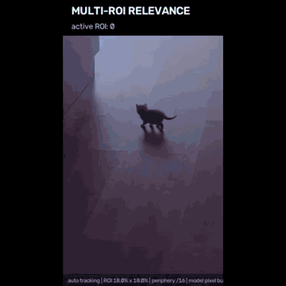</p>

FoveaStream can protect multiple relevant regions simultaneously. The built-in fallback uses camera-motion compensation + residual motion proposals, but external evidence can come from gaze, OCR, depth, task rules, AR anchors, detectors, downstream model feedback, or user input.

```python
optimizer = FoveaStreamTransform(
    preset="aggressive",
    auto_motion_proposals=True,
)
```

External proposals can be supplied without changing the core runtime.

---

## 2. 10 tiles / linear degradation

<p align="center">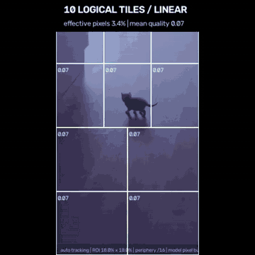</p>

Coarse logical tiling. Good when metadata/transport overhead matters more than precise spatial allocation.

```python
TilePlannerConfig(
    target_tiles=10,
    curve="linear",
    aggregation="max",
)
```

---

## 3. 25 tiles / smoothstep

<p align="center">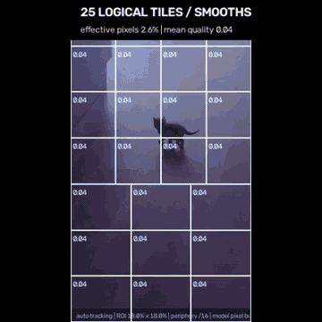</p>

A medium-coarse grid with a softer transition than linear degradation.

```python
TilePlannerConfig(
    target_tiles=25,
    curve="smoothstep",
    aggregation="max",
)
```

---

## 4. 100 tiles / Gaussian

<p align="center">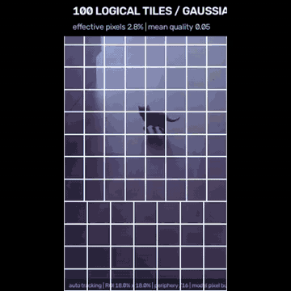</p>

A useful general-purpose operating point: enough spatial resolution for several ROIs without creating hundreds of tiny regions.

```python
TilePlannerConfig(
    target_tiles=100,
    curve="gaussian",
    curve_strength=3.0,
    aggregation="max",
    min_quality=0.04,
    min_resolution_scale=0.125,
)
```

---

## 5. 100 tiles / exponential

<p align="center">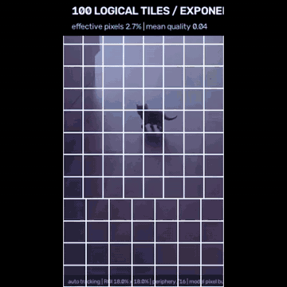</p>

Exponential degradation spends quality more aggressively near the ROI and falls away faster than a gentle linear policy.

```python
TilePlannerConfig(
    target_tiles=100,
    curve="exponential",
    curve_strength=3.0,
)
```

---

## 6. 400 tiles / Gaussian

<p align="center">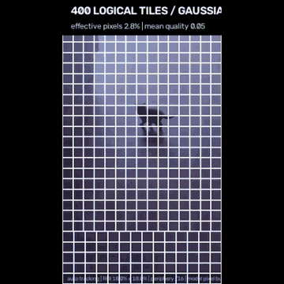</p>

Fine-grained spatial allocation. More accurate around ROI boundaries, with more tile metadata/control overhead.

```python
TilePlannerConfig(
    target_tiles=400,
    curve="gaussian",
    curve_strength=3.0,
)
```

---

## 7. Encoder delta-QP field

<p align="center">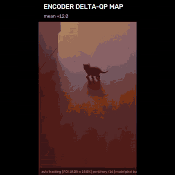</p>

Instead of damaging RGB before encoding, a codec adapter can preserve the original source frame and consume a spatial delta-QP map:

```python
out.encoder_hints.block_size
out.encoder_hints.qp_delta_map
out.encoder_hints.rois
```

Conceptually:

```text
original frame ---------------------------+
                                         |
FoveaStream relevance -> delta-QP map ----+--> H.264/H.265/AV1 encoder
```

The core provides portable encoder hints. NVENC, MediaCodec, VideoToolbox and VAAPI translation remain platform-adapter work.

---

## 8. Temporal ROI cache: SEND vs REUSE

<p align="center">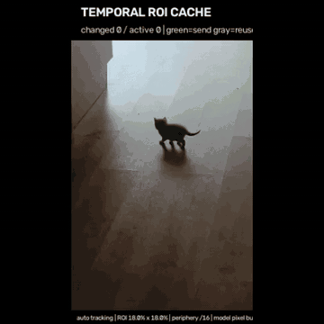</p>

High-resolution ROI data is resent only when it changes enough or reaches the forced-refresh timeout.

```text
frame 100  ROI A changed -> SEND
frame 101  ROI A same    -> REUSE
frame 102  ROI A same    -> REUSE
frame 103  ROI A changed -> SEND
```

The comparison is against the **last emitted high-resolution ROI state**, not merely frame `N-1`.

```python
AdaptiveTransportConfig(
    temporal_cache=True,
)
```

---

## 9. Packed context + ROI atlas

<p align="center"></p>

For APIs that accept one image but not multiple images, FoveaStream can pack low-resolution context plus changed high-resolution ROI crops into one image.

```python
if out.layered.atlas is not None:
    model.send_image(out.layered.atlas.image)
```

---

# Logical tile count: spatial precision vs overhead

`target_tiles` is an **exact requested logical tile count**. Logical tiles are an application/transport abstraction and are separate from encoder macroblocks/QP blocks.

<table>
<tr><td><b>10 tiles</b><br>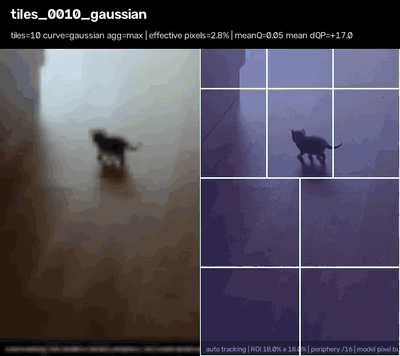</td><td><b>25 tiles</b><br>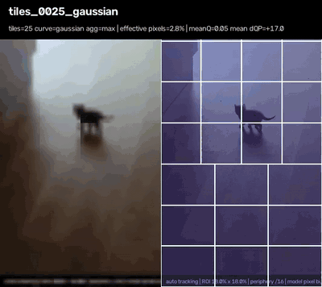</td></tr>
<tr><td><b>100 tiles</b><br>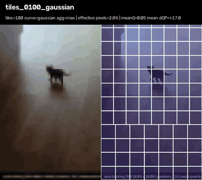</td><td><b>400 tiles</b><br>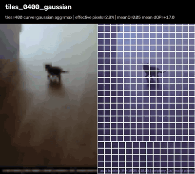</td></tr>
</table>

```python
TilePlannerConfig(target_tiles=10)
TilePlannerConfig(target_tiles=25)
TilePlannerConfig(target_tiles=100)
TilePlannerConfig(target_tiles=400)
```

- **10**: coarse, low control overhead.
- **25**: coarse/medium.
- **100**: useful general-purpose default.
- **400**: fine spatial allocation around ROI boundaries.

Each tile exposes:

```text
index / row / column
x / y / w / h
relevance
distance
quality
resolution_scale
qp_delta
```

A custom transport can consume the plan directly:

```python
for tile in plan.tiles:
    transport.send_tile(
        tile_id=tile.index,
        rect=(tile.x, tile.y, tile.w, tile.h),
        resolution_scale=tile.resolution_scale,
        qp_delta=tile.qp_delta,
    )
```

`send_tile()` is adapter pseudocode; FoveaStream supplies the policy, not a mandatory transport.

---

# Built-in tile degradation curves

The curve maps normalized distance from relevance (`0.0` = nearest / most relevant, `1.0` = farthest) to raw quality.

<table>
<tr><td><b>Linear</b><br>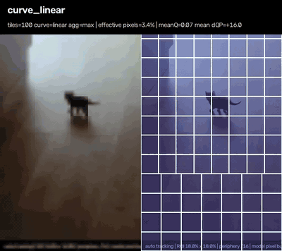</td><td><b>Smoothstep</b><br></td></tr>
<tr><td><b>Gaussian</b><br>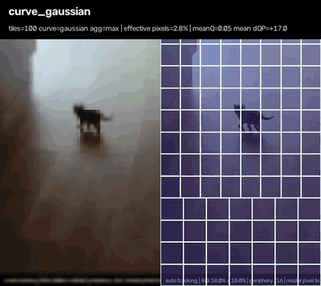</td><td><b>Exponential</b><br></td></tr>
<tr><td colspan="2"><b>Power</b><br>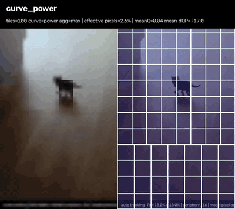</td></tr>
</table>

```python
TilePlannerConfig(target_tiles=100, curve="linear")
TilePlannerConfig(target_tiles=100, curve="smoothstep")
TilePlannerConfig(target_tiles=100, curve="gaussian", curve_strength=3.0)
TilePlannerConfig(target_tiles=100, curve="exponential", curve_strength=3.0)
TilePlannerConfig(target_tiles=100, curve="power", curve_strength=3.0)
```

`curve_strength` changes how quickly quality collapses away from relevance. Higher values are generally more aggressive.

---

# Tile relevance aggregation

A logical tile may cover many relevance-map samples. `aggregation` decides how those samples become one tile relevance value.

<table>
<tr><td><b>mean</b><br>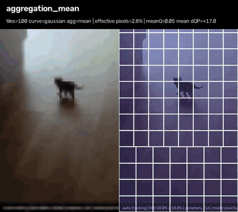</td><td><b>p90</b><br></td></tr>
<tr><td colspan="2"><b>max</b><br></td></tr>
</table>

```python
TilePlannerConfig(aggregation="mean")
TilePlannerConfig(aggregation="p90")
TilePlannerConfig(aggregation="max")
```

- `mean`: most aggressive; a tiny important region can be diluted inside a coarse tile.
- `p90`: robust high-relevance aggregation.
- `max`: safest for protecting a small important region.

---

# Custom tile policies

You do **not** need to modify FoveaStream to invent your own tile degradation logic.

## Custom distance -> quality: gentle nonlinear falloff

<p align="center">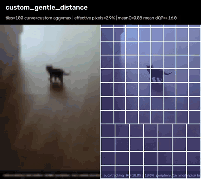</p>

```python
def my_degradation(distance: float) -> float:
    return max(0.0, 1.0 - distance ** 1.7)

planner = TilePlanner(
    TilePlannerConfig(
        target_tiles=100,
        min_quality=0.03,
        min_resolution_scale=0.10,
    ),
    degradation_fn=my_degradation,
)
```

---

## Custom distance -> quality: protected-focus cliff

<p align="center"></p>

Keep a high-quality plateau near relevance and then deliberately fall off hard.

```python
def focus_cliff(distance: float) -> float:
    if distance <= 0.18:
        return 1.0
    return max(0.0, 1.0 - ((distance - 0.18) / 0.82) ** 0.55)
```

---

## Full context-aware quality function

<p align="center">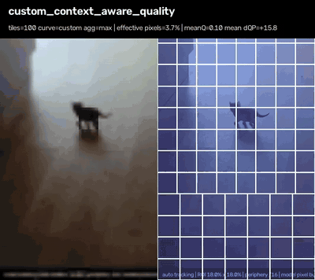</p>

For full control, use `TilePolicyContext` rather than only distance:

```python
from foveastream import TilePolicyContext


def quality_policy(ctx: TilePolicyContext) -> float:
    return max(
        ctx.max_relevance,
        0.8 * ctx.p90_relevance,
        0.55 * ctx.mean_relevance,
    )

planner = TilePlanner(
    TilePlannerConfig(target_tiles=100),
    quality_fn=quality_policy,
)
```

`TilePolicyContext` exposes geometry and statistics:

```text
index / row / column
x / y / w / h
center_x / center_y / area_fraction
relevance / distance
mean_relevance / max_relevance / p90_relevance
map_width / map_height
```

---

## Custom stepped resolution

<p align="center">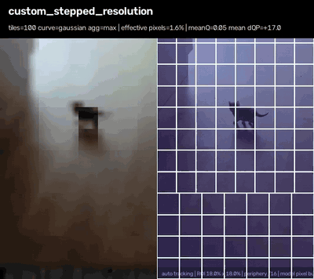</p>

Useful when hardware or transport prefers discrete resolution levels.

```python
def stepped_resolution(ctx, quality):
    if quality >= 0.82:
        return 1.0
    if quality >= 0.55:
        return 0.5
    if quality >= 0.25:
        return 0.25
    return 0.125

planner = TilePlanner(
    TilePlannerConfig(target_tiles=100),
    resolution_fn=stepped_resolution,
)
```

---

## Custom tiered delta-QP

<p align="center">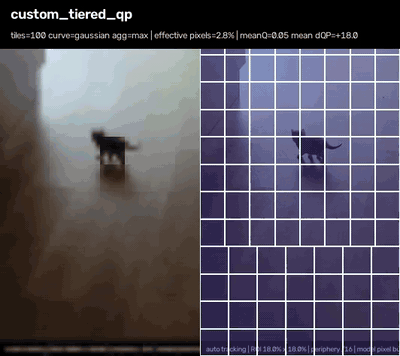</p>

```python
def tiered_qp(ctx, quality):
    if quality >= 0.85:
        return -6
    if quality >= 0.60:
        return 0
    if quality >= 0.30:
        return 8
    return 18

planner = TilePlanner(
    TilePlannerConfig(target_tiles=100),
    qp_fn=tiered_qp,
)
```

Advanced hooks can be combined:

```python
planner = TilePlanner(
    TilePlannerConfig(
        target_tiles=137,
        aggregation="p90",
        min_quality=0.02,
        min_resolution_scale=0.125,
    ),
    quality_fn=quality_policy,
    resolution_fn=stepped_resolution,
    qp_fn=tiered_qp,
)
```

Full policy documentation: [`docs/TILE_POLICIES.md`](docs/TILE_POLICIES.md).

---

# Benchmark your own custom policy

Create `my_policy.py`:

```python
from foveastream import TilePolicyContext


def quality(ctx: TilePolicyContext) -> float:
    return max(ctx.p90_relevance, 0.6 * ctx.max_relevance)


def resolution(ctx: TilePolicyContext, quality: float) -> float:
    return 1.0 if quality > 0.7 else 0.25


def qp(ctx: TilePolicyContext, quality: float) -> int:
    return round(18 - 24 * quality)
```

Run it through the same gallery:

```powershell
python bench\benchmark_gallery.py example.mp4 `
  --custom-quality my_policy.py:quality `
  --custom-resolution my_policy.py:resolution `
  --custom-qp my_policy.py:qp `
  --clean
```

The user policy appears under `09_user_policy/` with its own preview and metrics.

---

# Context + ROI layered transport

```python
out = adaptive.process(frame_rgb, timestamp_s)

images = [out.layered.context]
images += [
    roi.image
    for roi in out.layered.changed_rois
    if roi.image is not None
]

model.send_images(images)
```

This is useful for VLMs or machine-vision consumers that can accept low-resolution context plus multiple high-resolution crops.

---

# Background tile cache

For mostly static image-space backgrounds:

```python
AdaptiveTransportConfig(background_cache=True)
```

Do not enable it blindly for a freely moving camera. Without world/camera compensation, global motion invalidates many cached background tiles.

---

# Adaptive bitrate / pixel controller

Instead of fixing one preset forever, target a budget:

```python
AdaptiveBudgetConfig(
    target_bitrate_bps=2_000_000,
    target_pixel_fraction=0.20,
)
```

Feed real encoder output back:

```python
optimizer.feedback_encoded(
    encoded_bytes=actual_size,
    duration_s=frame_duration,
)
```

The controller can adapt ROI budget, context resolution, peripheral scale, quality floor, falloff and QP strength.

---

# Presets

| Preset | Periphery | Falloff | Quality floor | Max ROI | ROI budget |
|---|---:|---:|---:|---:|---:|
| balanced | /8 | 2.8 | 0.04 | 8 | 30% |
| aggressive | /16 | 4.5 | 0.01 | 6 | 22% |
| extreme | /24 | 6.5 | 0.00 | 4 | 15% |

These are starting policies, not universal optimal settings.

---

# Real-video benchmark numbers

Primary codec comparison uses the **same decoded frames and the same libx264 settings** for baseline and FoveaStream output.

| Video | Preset | Baseline H.264 | FoveaStream H.264 | H.264 saving | Context + ROI pixel saving |
|---|---|---:|---:|---:|---:|
| example1 | balanced | 824.3 kB | 293.1 kB | 64.45% | 92.26% |
| example1 | **aggressive** | 824.3 kB | **236.6 kB** | **71.30%** | **96.26%** |
| example1 | extreme | 824.3 kB | 218.6 kB | 73.48% | 97.50% |
| example2 | balanced | 3.720 MB | 2.847 MB | 23.46% | 75.54% |
| example2 | **aggressive** | 3.720 MB | **2.554 MB** | **31.34%** | **84.08%** |
| example2 | extreme | 3.720 MB | 2.138 MB | 42.53% | 89.61% |

Aggressive processing measured approximately **20.16 ms/frame (~49.6 FPS)** on example1 and **29.28 ms/frame (~34.2 FPS)** on example2 in the Python/OpenCV reference benchmark. Those timings describe FoveaStream processing itself, not capture + encode + network + remote inference.

Reproduce on your own video:

```powershell
python bench\benchmark_suite.py example.mp4 `
  --preset aggressive `
  --tiles 100 `
  --tile-curve gaussian
```

Or run the complete gallery:

```powershell
python bench\benchmark_gallery.py example.mp4 --clean
```

---

# What is implemented today

Implemented:

- causal frame-by-frame runtime;
- multi-ROI tracking and prediction;
- relevance / quality maps;
- same-size foveated RGB output;
- exact-count logical tiles;
- five built-in tile degradation curves;
- custom degradation, quality, resolution and QP callbacks;
- portable encoder block delta-QP hints;
- context + changed-ROI layered payload;
- temporal high-resolution ROI reuse;
- packed one-image atlas;
- optional background tile cache;
- adaptive bitrate / pixel-budget controller;
- SEND/SKIP scheduler;
- realtime latest-frame bridge;
- Python reference API and Rust native core/control-plane pieces;
- reproducible benchmark gallery with GIF/MP4/JSON/CSV outputs.

Still adapter/platform work:

- CameraX/Camera2 zero-copy integration;
- AVFoundation/CVPixelBuffer zero-copy integration;
- native NV12/YUV hot path;
- direct NVENC ROI/QP adapter;
- direct MediaCodec QP adapter;
- direct VideoToolbox/VAAPI adapter;
- concrete WebRTC/GStreamer adapters.

Do not describe those platform-specific adapters as complete until they exist and have been measured.

---

# Documentation

- [`docs/API_REFERENCE.md`](docs/API_REFERENCE.md) — Python public API.
- [`docs/TILE_POLICIES.md`](docs/TILE_POLICIES.md) — tile policy model and custom callbacks.
- [`docs/BENCHMARK_GALLERY.md`](docs/BENCHMARK_GALLERY.md) — complete benchmark-gallery workflow.
- [`docs/ADAPTIVE_TRANSPORT.md`](docs/ADAPTIVE_TRANSPORT.md) — adaptive transport internals.
- [`docs/FRAME_MIDDLEWARE.md`](docs/FRAME_MIDDLEWARE.md) — source -> transform -> sink contract.
- [`docs/AGENT_INTEGRATION.md`](docs/AGENT_INTEGRATION.md) — integration guide for coding agents.
- [`docs/STATUS.md`](docs/STATUS.md) — exact current implementation boundary.
- [`AGENTS.md`](AGENTS.md) — invariants and handoff rules for coding agents.

---

# License

Evaluation / non-commercial use is covered by the repository license. Commercial use requires a separate license.

Commercial / OEM / redistribution enquiries: **p.duplinsky@gmail.com**
