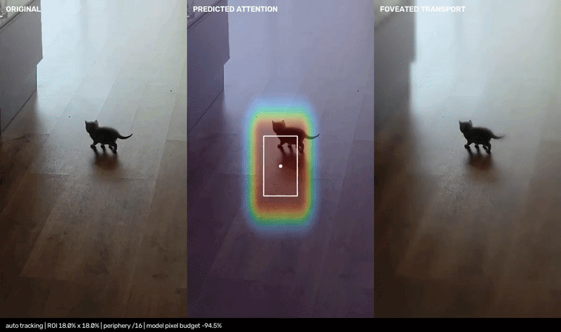
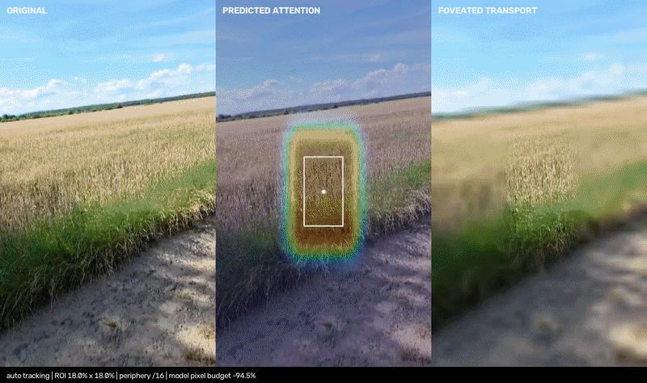

# FoveaStream

**Adaptive relevance-aware middleware for camera, video and machine-vision pipelines.**

FoveaStream sits between an existing frame source and an existing consumer. It keeps the important parts of a scene at higher fidelity and spends progressively less bandwidth, pixels and model input on less relevant regions.

It is designed to be inserted into an existing pipeline rather than replace it.

```text
camera / decoder / RTSP / WebRTC / file / AR glasses / robot
                              |
                              v
                        FoveaStream
                relevance + temporal state
                              |
          +-------------------+--------------------+
          |                   |                    |
          v                   v                    v
 same-size frame       context + changed ROIs    QP map
          |                   |                    |
          v                   v                    v
 encoder / stream           VLM/API          smart encoder
```

FoveaStream is **provider agnostic**. Core logic does not depend on Gemini, OpenAI, WebRTC, GStreamer, CameraX, AVFoundation, one object detector or one model provider.

---

## Quick start: pull the latest version and test `example3.mp4`

If you already cloned the repository:

```powershell
git switch main
git pull origin main

.\.venv\Scripts\Activate.ps1
python -m pip install -r requirements.txt
```

If you do not have the virtual environment yet:

```powershell
git clone https://github.com/SirPaul-code/foveated_streaming_lib.git
cd foveated_streaming_lib
.\scripts\setup.ps1
.\.venv\Scripts\Activate.ps1
```

Put any video in the repository root, for example:

```text
foveated_streaming_lib/
  example3.mp4
```

### 1. Run the full benchmark suite

```powershell
python bench\benchmark_suite.py example3.mp4 --preset aggressive
```

This produces both the codec benchmark and the adaptive-transport benchmark under:

```text
output/benchmark_suite/example3/
```

Important outputs:

```text
output/benchmark_suite/example3/
  example3_benchmark_suite.json
  example3_transport.json

  codec/
    example3_baseline_crf23.mp4
    example3_foveated_crf23.mp4
    example3_visualization.mp4
    example3_benchmark.json
```

The command prints the headline numbers directly:

```text
H.264 bytes saved
context + ROI pixels saved
codec processing ms/frame
adaptive transport mean/p95 ms/frame
temporal ROI reuse
layered payload pixel fraction
```

### 2. Visually inspect the full adaptive stack on the video

```powershell
python examples\adaptive_transport.py --video example3.mp4 --preset aggressive
```

The preview shows the optimized same-size frame and live statistics including active ROI count, changed ROI count, layered-payload fraction, mean delta-QP and processing time.

Headless:

```powershell
python examples\adaptive_transport.py --video example3.mp4 --preset aggressive --no-preview
```

### 3. Run only the original codec/visual benchmark

```powershell
python bench\real_video_visualization.py example3.mp4 `
  --outdir output\example3_codec `
  --preset aggressive
```

### 4. Run only the adaptive transport benchmark

```powershell
python bench\benchmark_transport_stack.py example3.mp4 `
  --preset aggressive `
  --out output\example3_transport.json
```

---

# What FoveaStream actually does

FoveaStream does not define an ROI as a face, car, person or any other hardcoded class.

An ROI means:

> **Spatial support whose loss of detail would disproportionately hurt the current downstream task.**

Relevance may come from any combination of:

- residual motion;
- explicit user tap or rectangle;
- eye gaze or software gaze;
- AR anchors;
- saliency;
- OCR/text regions;
- depth/autofocus;
- hand/object interaction;
- detector or segmenter output;
- application rules;
- downstream model feedback;
- remote operator input;
- a future learned relevance model.

The built-in fallback is deliberately class agnostic.

```text
frame t-1 + frame t
        |
        v
sparse feature tracking
        |
        v
global camera-motion estimate
        |
        v
warp previous frame
        |
        v
residual motion
        |
        v
connected components
        |
        +--> ROI proposal 1
        +--> ROI proposal 2
        +--> ROI proposal N
```

Those proposals enter a persistent multi-ROI tracker. Tracks are deduplicated, associated across time, predicted into the future, expanded when uncertainty grows and constrained by a hard total ROI-area budget.

Motion is only one proposal source. A static crack, label or component may be task-critical while producing no motion, so stronger application evidence can be injected at any time.

---

# Architecture

The current v0.3 pipeline is more than a blur/downsample filter.

```text
                              arbitrary evidence
                  motion / gaze / task / OCR / model / depth
                                      |
                                      v
                                EvidenceBus
                           weighted + TTL fusion
                                      |
                                      v
                          predictive multi-ROI state
                                      |
                     latency-aware future prediction
                                      |
                                      v
                          adaptive spatial budget
                                      |
             +------------------------+------------------------+
             |                        |                        |
             v                        v                        v
       quality field            temporal cache           QP hints
             |                        |                        |
             v                        v                        v
 same-size foveation      context + changed ROIs     encoder block map
                                      |
                          +-----------+-----------+
                          |                       |
                          v                       v
                    layered payload           packed atlas
```

## 1. Multi-source relevance fusion

`EvidenceBus` accepts independent timestamped evidence sources. Each source can publish ROI proposals, points or dense relevance maps with its own weight and TTL.

The core does not need to know what generated the evidence.

## 2. Low-resolution analysis, full-resolution preservation

Expensive relevance analysis does not need to run at camera resolution.

```text
1080p / 4K source
      |
      +----> 256 px analysis path ---> relevance
      |
      +----> original frame ----------> output/encoder
```

Normalized coordinates allow low-resolution analysis to drive full-resolution preservation.

## 3. Persistent predictive multi-ROI tracking

The runtime supports zero, one or many simultaneous relevant regions.

Each track carries temporal state instead of rediscovering every ROI independently on every frame.

Prediction includes a configurable future horizon so the protected region can represent where relevance is expected to be **after encode/network/consumer latency**, not only where it was at capture time.

## 4. Hard ROI budget

A preset has a total normalized ROI-area budget. This is a hard cap.

If a predicted ROI is larger than the remaining budget it is center-preserving and aspect-preserving shrunk rather than silently allowing the total ROI set to consume the whole frame.

## 5. Same-size foveated frame

For the easiest integration, FoveaStream returns an ordinary frame with exactly the same width and height as the input.

```python
from foveastream import FoveaStreamTransform

optimizer = FoveaStreamTransform(preset="aggressive")
optimized = optimizer.transform(frame_rgb, timestamp_s)
downstream.send(optimized.frame_rgb)
```

This is the universal fallback for existing image/video pipelines.

It reduces spatial entropy but does **not** reduce the decoded raster dimensions. That is why FoveaStream also exposes lower-level outputs.

## 6. Context + high-resolution ROI payload

For consumers that accept multiple images, a full-resolution frame is often wasteful.

FoveaStream can provide:

```text
small low-resolution whole-scene context
+
N high-resolution relevant regions
```

This reduces actual image pixels presented to a VLM or other image consumer.

## 7. Temporal ROI cache

A high-resolution region is not resent simply because it still exists.

```text
frame 100: ROI A changed  -> send
frame 101: ROI A same     -> reuse
frame 102: ROI A same     -> reuse
frame 103: ROI A same     -> reuse
frame 104: ROI A changed  -> send
```

Change is compared against the **last emitted high-resolution state**, not merely the previous frame. Slow accumulated changes therefore eventually trigger a refresh.

A maximum refresh timeout prevents indefinite reuse.

## 8. Background tile cache

For mostly static cameras, an optional tile cache emits only background tiles that changed materially or exceeded their refresh timeout.

This mode is intentionally opt-in. A freely moving camera invalidates image-space tiles unless the application provides camera/world compensation.

## 9. Layered payload

The adaptive transport can produce:

```text
low-res global context
+
changed high-res ROI enhancements
+
optional changed background tiles
```

The base context remains available even if an enhancement is delayed or dropped.

## 10. Packed ROI atlas

Some APIs accept one image but not a list of images. FoveaStream can pack the current context and changed high-resolution ROIs into one RGB atlas plus placement metadata.

```text
+----------------------------------+
| low-res whole-scene context      |
+----------------+-----------------+
| changed ROI 1  | changed ROI 2   |
+----------------+-----------------+
| changed ROI 3                    |
+----------------------------------+
```

## 11. Encoder spatial hints / delta-QP map

Instead of modifying RGB before encoding, a capable encoder can keep the original source frame and receive a spatial quality policy.

```text
original frame ----------------------------+
                                          |
FoveaStream relevance -> block delta-QP --+--> encoder
```

The portable `EncoderSpatialHints` output contains:

- block size;
- signed `int8` delta-QP map;
- active ROI metadata;
- foveal/peripheral reference deltas.

This is an encoder-independent contract. Direct MediaCodec, NVENC, VideoToolbox and VAAPI adapters still need to translate it to each platform API.

## 12. Adaptive bitrate / pixel-budget controller

A fixed preset can be only the starting point.

The optional closed-loop controller can target encoder bitrate and/or layered-payload pixel fraction and continuously change:

- peripheral scale;
- falloff width;
- ROI-area budget;
- maximum active ROI count;
- context scale;
- quality floor;
- uncertainty floor;
- peripheral delta-QP.

Conceptually:

```text
actual bitrate > target
        |
        v
increase optimization strength
        |
        v
fewer spatial bits / smaller payload
```

When a real encoder is connected, feed actual encoded byte counts back into the controller.

---

# Drop-in middleware

## Existing synchronous loop

Before:

```python
frame = camera.read()
downstream.send(frame)
```

After:

```python
from foveastream import FoveaStreamTransform

optimizer = FoveaStreamTransform(
    preset="aggressive",
    auto_motion_proposals=True,
)

frame = camera.read()
optimized = optimizer.transform(frame)
downstream.send(optimized.frame_rgb)
```

The source and destination do not need to understand FoveaStream internals.

## Callback-driven realtime capture

```python
from foveastream import CallbackFrameSink, FoveaStreamTransform, RealtimeBridge

optimizer = FoveaStreamTransform(
    preset="aggressive",
    emit_policy="every_frame",
)

sink = CallbackFrameSink(
    lambda packet: downstream.send(packet.frame_rgb)
)

bridge = RealtimeBridge(
    optimizer,
    sink,
    queue_size=1,
    drop_policy="latest",
)

camera.on_frame(lambda frame, ts: bridge.submit(frame, ts))
```

If capture temporarily outruns processing, `drop_policy="latest"` replaces stale queued frames with the newest state instead of allowing latency to grow without bound.

```text
60 FPS source
     |
     v
latest-frame queue (bounded)
     |
     v
30-60 FPS optimizer
```

Use `drop_policy="block"` only when every frame must be processed and backpressure into the source is acceptable.

## Continuous video vs request-style SEND/SKIP

Continuous video defaults to:

```python
emit_policy="every_frame"
```

Request/event pipelines may opt into:

```python
emit_policy="when_send"
```

SEND/SKIP is useful when a model/API does not need redundant frames. It should not silently remove frames from a transport that requires continuous cadence.

---

# Full adaptive API

```python
from foveastream import (
    AdaptiveBudgetConfig,
    AdaptiveTransportConfig,
    AdaptiveTransportRuntime,
    LatencyBudget,
)

optimizer = AdaptiveTransportRuntime(
    AdaptiveTransportConfig(
        preset="aggressive",
        auto_motion_proposals=True,
        temporal_cache=True,
        background_cache=False,
        build_atlas=True,
        latency=LatencyBudget(
            encode_s=0.015,
            network_s=0.040,
            consumer_s=0.020,
            safety_s=0.015,
        ),
        budget=AdaptiveBudgetConfig(
            target_pixel_fraction=0.20,
        ),
    )
)

out = optimizer.process(frame_rgb, timestamp_s)
```

Available outputs include:

```python
out.frame_rgb

out.process_result.rois
out.process_result.tracks
out.process_result.quality_map
out.process_result.qp_map

out.layered.context
out.layered.changed_rois
out.layered.background_updates
out.layered.atlas

out.encoder_hints.qp_delta_map
out.payload_pixel_fraction
out.controller_state
```

### Ordinary video path

```python
downstream.send(out.frame_rgb)
```

### Multi-image VLM path

```python
images = [out.layered.context]
images += [
    region.image
    for region in out.layered.changed_rois
    if region.image is not None
]
model.send_images(images)
```

### Single-image API path

```python
if out.layered.atlas is not None:
    model.send_image(out.layered.atlas.image)
```

### Encoder path

```python
encoder.set_spatial_qp_map(out.encoder_hints.qp_delta_map)
encoder.encode(original_frame)
```

The final two calls above are intentionally adapter pseudocode: each encoder family has its own API.

---

# Presets

| Preset | Peripheral source | Context scale | Max ROIs | Hard ROI-area budget | Peripheral quality floor |
|---|---:|---:|---:|---:|---:|
| `balanced` | 1/8 per axis | 0.25 | 8 | 30% | `0.04 + uncertainty` |
| `aggressive` | **1/16 per axis** | **0.15** | **6** | **22%** | `0.01 + uncertainty` |
| `extreme` | 1/24 per axis | 0.10 | 4 | 15% | `0.00 + uncertainty` |

`context_scale=0.15` means 15% width × 15% height, so the global context alone contains only **2.25% of full-frame pixels** before ROI enhancements are added.

For general testing, `aggressive` is the recommended starting point.

---

# Real-video benchmark

The checked-in benchmark uses two real approximately 60 FPS H.264 phone videos. FoveaStream processes approximately 30 FPS and compares the optimized video against a **baseline re-encode of exactly the same decoded frames**.

Both arms use:

```text
encoder:       libx264
preset:        veryfast
CRF:           23
pixel format:  yuv420p
```

This avoids claiming savings merely because the original phone file happened to use different encoder settings.

Reference benchmark environment:

```text
CPU:      AMD EPYC 9V74 80-Core Processor
Python:   3.13.5
OpenCV:   4.13.0
NumPy:    2.3.5
FFmpeg:   7.1.5
```

## Aggressive preset

| Video | Baseline H.264 | FoveaStream H.264 | H.264 bytes saved | Context + ROI pixels saved | Processing | Active ROIs |
|---|---:|---:|---:|---:|---:|---:|
| `example1.mp4` | 824.3 kB | **236.6 kB** | **71.30%** | **96.26%** | **20.16 ms/frame (~49.6 FPS)** | 1.13 mean / 3 max |
| `example2.mp4` | 3.720 MB | **2.554 MB** | **31.34%** | **84.08%** | **29.28 ms/frame (~34.2 FPS)** | 3.30 mean / 6 max |

Across both clips together:

```text
same-encoder baseline: 4.544 MB
aggressive output:     2.790 MB
byte reduction:        38.59%
```

These processing timings are reference-host measurements, not universal device latency claims.

Machine-readable source data:

[`docs/assets/real_demo/benchmark_presets_2026-09-14.json`](docs/assets/real_demo/benchmark_presets_2026-09-14.json)

## Full preset results

### `example1.mp4`

| Preset | Output | H.264 saving | Context + ROI pixel saving | Mean ROI area | Max ROI area |
|---|---:|---:|---:|---:|---:|
| balanced | 293.1 kB | **64.45%** | **92.26%** | 1.49% | 6.25% |
| aggressive | **236.6 kB** | **71.30%** | **96.26%** | 1.49% | 6.25% |
| extreme | 218.6 kB | **73.48%** | **97.50%** | 1.49% | 6.25% |

### `example2.mp4`

| Preset | Output | H.264 saving | Context + ROI pixel saving | Mean ROI area | Max ROI area |
|---|---:|---:|---:|---:|---:|
| balanced | 2.847 MB | **23.46%** | **75.54%** | 18.19% | **30.00% cap** |
| aggressive | **2.554 MB** | **31.34%** | **84.08%** | 13.66% | **22.00% cap** |
| extreme | 2.138 MB | **42.53%** | **89.61%** | 9.38% | **15.00% cap** |

The second video is materially harder: more simultaneous relevant regions consume much more of the spatial budget. The result demonstrates why multi-ROI budgeting matters.

---

# What the benchmark metrics mean

## H.264 byte saving

```text
same decoded frames
      |
      +--> ordinary libx264 CRF23 ---------- baseline bytes
      |
      +--> FoveaStream RGB -> libx264 CRF23 - optimized bytes
```

This measures whether reduced spatial entropy gives an ordinary codec fewer bytes to encode.

## Context + ROI pixel saving

This is a different output mode.

```text
full frame pixels
vs.
low-res context pixels + high-res ROI pixels
```

It estimates actual pixels a compatible VLM/image consumer would receive.

## Temporal ROI reuse

The adaptive benchmark measures how often a persistent high-resolution ROI can reuse the last emitted state instead of being sent again.

## Layered pixel fraction

The fraction of full-frame pixels represented by the low-resolution context plus currently changed high-resolution enhancements.

## Atlas pixel fraction

The equivalent size of the one-image packed context+ROI representation.

## Delta-QP statistics

Statistics over the portable encoder block map. They are **not** a claim of hardware-encoder byte saving until a concrete encoder adapter consumes that map.

---

# Benchmark your own video properly

Recommended:

```powershell
python bench\benchmark_suite.py example3.mp4 --preset aggressive
```

For all three presets:

```powershell
'balanced','aggressive','extreme' | ForEach-Object {
  python bench\benchmark_suite.py example3.mp4 `
    --preset $_ `
    --outdir "output\benchmark_$_"
}
```

Static-camera experiment with the background cache:

```powershell
python bench\benchmark_suite.py example3.mp4 `
  --preset aggressive `
  --background-cache
```

Adaptive layered-pixel target:

```powershell
python bench\benchmark_suite.py example3.mp4 `
  --preset aggressive `
  --target-pixel-fraction 0.20
```

To benchmark multiple videos in one command:

```powershell
python bench\benchmark_suite.py example3.mp4 example4.mp4 example5.mp4 `
  --preset aggressive
```

---

# Existing GIF visualization

The GIFs below are intentionally kept as simple before/after visual examples. The current runtime is substantially more capable than the original single-view demo and supports multiple simultaneous ROI tracks, temporal reuse, layered payloads and encoder hints.

<p align="center">
  
</p>

<p align="center">
  
</p>

---

# Realtime behavior

The processing path is causal. Frame `N` does not require future frame `N+1`.

Capture FPS, relevance-analysis FPS, optimizer FPS and downstream/model FPS do not have to match.

```text
camera:                60 FPS
local evidence:        30-200 Hz depending on source
optimizer:             device dependent
remote model:           1-10 requests/s or event-driven
```

The bounded latest-frame bridge is designed for latency-sensitive capture when the source can temporarily run faster than processing.

Reference Python benchmarks already demonstrate approximately 30 FPS processing on both checked-in test clips, but production target-device performance must be measured on the actual hardware.

---

# Native Rust control plane

The repository also contains the native Rust core and transport-control primitives.

```rust
use foveastream::{
    EmitPolicy,
    FrameInput,
    InnovationSignals,
    StreamMiddleware,
};

let mut optimizer = StreamMiddleware::aggressive();
optimizer.set_emit_policy(EmitPolicy::EveryFrame);

let output = optimizer.process_rgb8(
    FrameInput {
        rgb8: frame,
        width,
        height,
        timestamp_s,
    },
    &proposals,
    &points,
    InnovationSignals::default(),
)?;

if let Some(result) = output {
    downstream.send(&result.foveated_rgb8)?;
}
```

Native adaptive-transport primitives include latency budgeting, evidence TTL/fusion, ROI signatures, temporal region caching, adaptive budget control and portable encoder spatial hints.

The Python/OpenCV layer remains the reference integration, visualization and benchmark environment.

---

# Installation

## Windows

```powershell
git clone https://github.com/SirPaul-code/foveated_streaming_lib.git
cd foveated_streaming_lib
.\scripts\setup.ps1
.\.venv\Scripts\Activate.ps1
```

Manual setup:

```powershell
python -m venv .venv
.\.venv\Scripts\Activate.ps1
python -m pip install -r requirements.txt
```

Development/test dependencies:

```powershell
python -m pip install -r requirements-dev.txt
```

## Linux / macOS

```bash
git clone https://github.com/SirPaul-code/foveated_streaming_lib.git
cd foveated_streaming_lib
chmod +x scripts/setup.sh
./scripts/setup.sh
source .venv/bin/activate
```

FFmpeg with `libx264` is required for the MP4 codec benchmark. The middleware itself does not require FFmpeg.

---

# Validation

Python:

```powershell
pytest -q
```

Rust:

```powershell
cargo test --all-targets
cargo build --release
```

The configured CI matrix covers Python plus Rust test/release builds on Ubuntu, Windows and macOS.

---

# Current implementation status

## Implemented

- causal frame-by-frame processing;
- drop-in same-size frame transform;
- provider-independent source/transform/sink boundary;
- bounded latest-frame realtime bridge;
- class-agnostic residual-motion proposals;
- arbitrary external ROI evidence;
- multi-source relevance fusion with TTL;
- persistent predictive multi-ROI tracking;
- hard total ROI-area budget;
- latency-aware future ROI prediction;
- low-resolution analysis/full-resolution output pattern;
- same-size foveated RGB output;
- context + multiple high-resolution ROI views;
- temporal high-resolution ROI reuse;
- optional static-background tile cache;
- layered context + changed-ROI payload;
- packed one-image ROI atlas;
- portable signed delta-QP block map;
- adaptive bitrate/pixel-budget controller;
- SEND/SKIP recommendation for request/event pipelines;
- Python reference/integration API;
- Rust native control-plane primitives;
- reproducible codec benchmark;
- reproducible adaptive transport benchmark;
- one-command combined benchmark suite.

## Still platform/adapter work

- direct NV12/YUV hot path throughout the full runtime;
- zero-copy AHardwareBuffer / CVPixelBuffer / DMA-BUF integration;
- CameraX/Camera2 adapter;
- AVFoundation adapter;
- OpenXR/Meta camera adapter;
- direct MediaCodec spatial-QP/ROI adapter;
- direct NVENC spatial-QP/ROI adapter;
- direct VideoToolbox/VAAPI adapter;
- concrete WebRTC/RTP/GStreamer layered packetization;
- world-locked background cache for freely moving cameras;
- stateful C ABI for the full high-level adaptive runtime;
- target-device p50/p95/energy matrix;
- broad downstream task-quality validation.

Do not treat the portable QP map as proof of NVENC/MediaCodec savings until a real adapter consumes it and is benchmarked.

---

# Repository layout

```text
src/
  middleware.rs       native drop-in middleware
  streaming.rs        native runtime / ProcessResult
  transport.rs        adaptive transport control-plane primitives
  roi.rs              multi-ROI tracker + hard spatial budget
  predictive.rs       prediction / uncertainty primitives
  scheduler.rs        SEND/SKIP controller

python/foveastream/
  middleware.py       FramePacket / transform / RealtimeBridge
  streaming.py        reference runtime / motion proposals / ROI tracking
  optimization.py     adaptive transport stack

examples/
  live_webcam.py
  custom_sink_adapter.py
  adaptive_transport.py

bench/
  real_video_visualization.py
  benchmark_transport_stack.py
  benchmark_suite.py

docs/
  ADAPTIVE_TRANSPORT.md
  FRAME_MIDDLEWARE.md
  AGENT_INTEGRATION.md
  REALTIME_STREAMING_STATUS.md
  PREDICTIVE_ATTENTION_ARCHITECTURE.md
  STATUS.md

AGENTS.md              durable coding-agent integration contract
```

---

# Documentation for coding agents

A new coding agent should read in this order:

1. [`AGENTS.md`](AGENTS.md)
2. [`docs/ADAPTIVE_TRANSPORT.md`](docs/ADAPTIVE_TRANSPORT.md)
3. [`docs/FRAME_MIDDLEWARE.md`](docs/FRAME_MIDDLEWARE.md)
4. [`docs/STATUS.md`](docs/STATUS.md)

The repository documentation is the durable handoff. Do not depend on chat history.

---

# License / commercial use

The repository is available for evaluation and permitted non-commercial use under the included [`LICENSE`](LICENSE).

For **commercial use, OEM integration, redistribution or commercial licensing**, contact:

**p.duplinsky@gmail.com**

No licensing server, telemetry or paywall is required by the current runtime.
